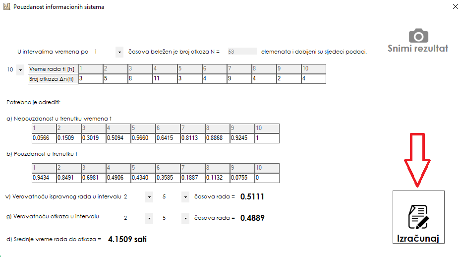

# <h4> Program koji računa pouzdanosti sistema praćenih kroz određeni period vremena.  </h2>

Koraci korišćenja programa su sledeći:

1. Odabraćemo koliko nam je intervala potrebno za račun  
2. Biramo veličinu intervala 
3. Unosimo broj otkaza za svaki interval  
4. Biramo po dva intervala za verovatnoću ispravnog rada i za verovatnoću otkaza  
5. Svi potrebni podaci su uneti, treba samo kliknuti na dugme izračunaj  

<h5> Rezultati su vidljivi u tabelama pod a i b. Kao i na kraju svakog reda pod v, g i d </h5>
<i>Ukoliko nam je potreban screenshot rezultata to nam omogućuje dugme <b>Snimi rezultat </b> koje može da se iskoristi samo nakon nekog računa.</i>

<h4> Aplikacija je izrađena u windows formama. </h4>
